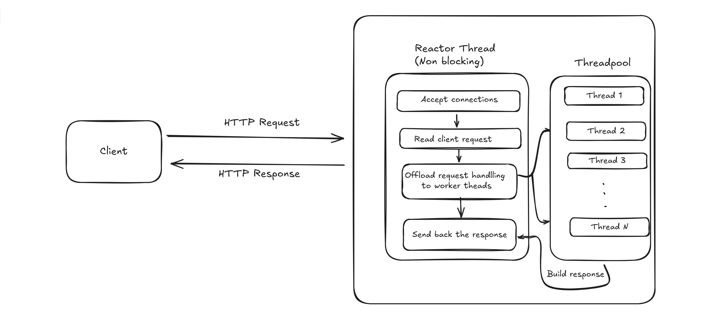

# HelixHTTP — a fast, non-blocking, event-driven C++ web server built from scratch with multithreading and modern design

> **Build. Benchmark. Understand.**  
> Learn how modern web servers work under the hood — from sockets and event loops to concurrency and performance tuning.

<p align="center">
  
  
  
  
</p>

## 🧩 Key Features

- **Event-driven using epoll (ET)** — uses edge-triggered epoll to handle many connections efficiently in a single reactor thread.    
- **Thread pool for request handling** — offloads request processing from the main reactor thread to worker threads. 
- **Routing system** — supports dynamic paths, query parameters, and simple middleware functions.  
- **Timeout manager** — tracks read, write, and processing timeouts to safely close inactive connections.  
- **Keep-alive reuse** — keeps sockets open for multiple requests, reducing connection overhead.  
- **Routing system** — supports path parameters (e.g. `/user/:id`), query parameters, and method-based routing (`GET`, `POST`, etc.).
- **Middleware support** — allows adding pre-processing logic (e.g. logging, authentication) before the main route handler runs.
- **Clean, modular design** — each component (server, connection, routing, timeout, logger, threadpool) is separated and easy to follow.
- **Response builder** — provides simple helpers to set status codes, headers, and bodies.
- **HTTP/1.1 support** — full request parsing, persistent connections, and keep-alive reuse. Request pipelining and chunked encode is not supported.

## ⚙️ Quick Start

### Build and run
```bash
make run

# Root
curl http://127.0.0.1:9000/

```
## 📘 Example Usage

### 🛣️ Define Routes
```cpp
// main.cpp
#include <server.h>
#include <iostream>

int main() {
    int threadCount = 8;
    HttpServer server(threadCount);

    // Basic route
    server.get("/", [](Request &req, Response &res){
        res.setBody("Hello from HelixHTTP!\n");
        res.sendResponse();
    });

    // Dynamic path parameter: /user/:id
    server.get("/user/:id", [](Request &req, Response &res){
        std::string userId = req.params["id"];
        res.setBody("User ID: " + userId + "\n");
        res.sendResponse();
    });

    // Query parameter example: /search?q=helix
    server.get("/search", [](Request &req, Response &res){
        std::string q = req.queryParams.count("q") ? req.queryParams.at("q") : "none";
        res.setBody("Search query: " + q + "\n");
        res.sendResponse();
    });
    server.listen(9000);
}
```

---

### ⚙️ Add Middleware

You can attach middlewares to run before route handlers (for logging, auth, etc.).

```cpp
server.use([](Request &req, Response &res) {
  //Perform required tasks like auth etc before invoking the handler for the request. 
});
```

## 🧠 Architecture — How HelixHTTP Works

HelixHTTP is designed around the **Reactor + Thread Pool** model, the same principle used by servers like Nginx and Envoy — but implemented from scratch in C++.

---

### **1. High-Level Design**

HelixHTTP cleanly separates concerns into two core subsystems:

* **Reactor Thread (Event Loop)** — runs a non-blocking `epoll` loop (edge-triggered) to handle all I/O events like accept, read, and write.
* **Thread Pool (Worker Threads)** — executes route handlers and user-defined logic concurrently.



### **2. Flow of a Request**

1. **Accept phase:**
   The reactor monitors the listening socket. When a new client connects, it accepts the socket in non-blocking mode and registers it in `epoll`.

2. **Read phase:**
   When `EPOLLIN` is triggered, data is read into buffers (without blocking). The existing ClientConnection object (created when the socket was accepted) maintains all state across read/write cycles and feeds data to the HTTP parser.

3. **Dispatch phase:**
   Once a full request is parsed, the existing `ClientConnection` is handed off to the thread pool for processing.

4. **Processing phase:**
   A worker thread executes the middleware and route handler — e.g., computes a result, reads a file, or simulates CPU/I/O work. The worker thread prepares the response and update that the response is ready to send. 

5. **Write phase:**
   The response is sent asynchronously by the reactor thread (using non-blocking `send()`). If the connection uses `keep-alive`, it’s reset for reuse.

---

### **3. Timeout Manager**

HelixHTTP has a lightweight **TimeoutManager** that uses a **min-heap** to track expiration times for each socket operation:

* **READ timeout** → request not received in time.
* **WRITE timeout** → response not sent in time.
* **PROCESSING timeout** → handler took too long.
* **IDLE timeout** → connection inactive too long.

Expired timers are checked periodically and corresponding connections are safely closed.

---

### **4. Core Components**

| Component              | Responsibility                                                |
| ---------------------- | ------------------------------------------------------------- |
| `Server`               | Sets up sockets, epoll, and manages event loop                |
| `ClientConnection`     | Represents a single client; tracks buffers, state, and timers |
| `ThreadPool`           | Dispatches and executes tasks concurrently                    |
| `TimeoutManager`       | Schedules and collects expired timeouts                       |
| `RouteHandler`         | Matches routes and invokes corresponding functions            |
| `Response` / `Request` | Encapsulate HTTP parsing and response building                |
| `Logger`               | Lightweight log utility for tracing events                    |

---

### **5. Example Route Flow**

```
GET /io HTTP/1.1
Host: localhost:9000

→ Reactor detects EPOLLIN
→ Parses request headers and body
→ Hands off to worker thread
→ Worker thread executes the middleware and corresponding api method. 
→ Response written asynchronously
→ Connection reused incase of keep-alive otherwise closed. 
```

---

### 6.Concurrency Model

HelixHTTP follows a **Reactor + Thread Pool** architecture, balancing low-latency I/O with multi-core parallelism.

* The **reactor thread** (main event loop) uses `epoll(EPOLLET)` to multiplex all socket I/O. It never blocks — just reacts to readiness events (`EPOLLIN`, `EPOLLOUT`, `EPOLLRDHUP`).
* The reactor handles **accept**, **read**, and **write** readiness for thousands of connections, maintaining minimal overhead.
* The **thread pool** executes user-defined route handlers in parallel once a request is completely parsed.
* The connection remains owned by the reactor; worker threads only handle request processing logic (e.g., computation, I/O simulation), not socket management.
* On completion, the worker thread signals the reactor to write the response asynchronously.

This model ensures:

### 7. Memory and Connection Management

HelixHTTP keeps resource management simple but safe. Every accepted socket is wrapped in a **ClientConnection** object that tracks its state — buffers, request metadata, response data, and timeouts.

### 1. **Connection Lifecycle**

* On `accept()`, a `ClientConnection` is created and added to an in-memory map keyed by the file descriptor (FD).
* When the client disconnects, encounters a timeout, or sends invalid data, the connection is gracefully closed and the FD is removed.
* Each connection maintains its **own buffers**, avoiding global shared state and reducing synchronization needs.

### 2. **Memory Safety**

* No raw heap allocations are exposed; most data structures are automatic or RAII-managed (`std::string`, `std::vector`, etc.).
* No per-request malloc/free churn; all buffers are reused as long as the connection is alive.
* Timeouts and event states are version-tracked to avoid stale references when connections are closed.

### 3. **Timeout Strategy**

* Each connection has timers for **READ**, **WRITE**, **PROCESSING**, and **IDLE** phases.
* The `TimeoutManager` uses a **min-heap priority queue** to efficiently find and close expired sessions.
* A version counter in each connection ensures only the most recent timeout is valid, preventing accidental closure of reused FDs.

### 4. **Keep-Alive and Reuse**

* Persistent connections allow multiple requests per TCP session.
* Once a response is sent, if the request has `Connection: keep-alive`, the state resets and the FD remains active for further reads.
* This minimizes connection churn and improves throughput under high concurrency.


* **Single-threaded I/O safety** — all epoll operations and state transitions happen in one thread.
* **Parallel CPU utilization** — application logic can scale with the number of cores.
* **Low context-switch overhead** — no per-request thread spawning or blocking system calls.

## ⚡ HelixHTTP Benchmark Results

All benchmarks were run on a **Linux machine (Intel i5, 8 cores, 16 GB RAM)** using [`wrk`](https://github.com/wg/wrk), over a **15-second duration** per test, targeting the same binary (`build/main`) compiled with `-O2` optimizations.

Each test measures **Requests/sec**, **average latency**, and **P99 latency** under increasing thread counts and concurrent connections.

---

### 🧩 1. Basic (Lightweight Route: `/`)

| Threads | Connections | Requests/sec | Avg Latency | P99 Latency | Transfer/sec |
| ------- | ----------- | ------------ | ----------- | ----------- | ------------ |
| 1       | 100         | **91,023**   | 1.10 ms     | 2.48 ms     | 11.11 MB     |
| 4       | 100         | **84,013**   | 1.25 ms     | 4.57 ms     | 10.26 MB     |
| 8       | 100         | **80,584**   | 1.29 ms     | 4.09 ms     | 9.84 MB      |
| 16      | 100         | **78,348**   | 1.35 ms     | 5.12 ms     | 9.56 MB      |

**Basic handle:** Just sets some headers and returns a string in response. 

**Observation:** Even a single-threaded reactor handles 90K+ requests per second with low latency. Increasing thread count doesn’t help much here as the the limit factor is the reactor thread which handles the `send()` and `receive()` calls. To improve the RPS, we need to run these reactor threads across mutliple threads. Then multiple threads can run the even loop, can accept new connections and handle send() and receive which increases RPS. 

---

### 🌐 2. I/O Heavy Route (`/io`) — Simulated 100ms blocking delay

| Threads | Connections | Requests/sec  | Avg Latency | P99 Latency | Transfer/sec |
| ------- | ----------- | ------------- | ----------- | ----------- | ------------ |
| 1       | 100         | **9.91**      | 6.69 s      | 10.03 s     | 1.16 KB      |
| 4       | 100         | **39.66**     | 2.30 s      | 2.51 s      | 4.65 KB      |
| 8       | 100         | **79.32**     | 1.20 s      | 1.30 s      | 9.29 KB      |
| 32      | 100         | **317.31**    | 310 ms      | 398 ms      | 37.18 KB     |
| 512     | 100         | **991.64**    | 100 ms      | 105 ms      | 116.21 KB    |
| 1024    | 10,000      | **10,053.14** | 949 ms      | 1.02 s      | 1.15 MB      |
| 5000    | 10,000      | **49,039.02** | 200 ms      | 238 ms      | 5.61 MB      |

**Observation:**
* As worker thread count rises, throughput scales dramatically (nearly 5000× from 1→5000 threads).
* Latency drops proportionally as more requests are concurrently processed.
* In a IO heavy system, it is preffered have many threads otherwise all the small number of threads might be blocked and cpu time will get wasted. 

---

### 🔥 3. CPU-Heavy Route (`/cpu`) — Ran a for loop for 10^6 iteration to simulate some CPU work. 

| Threads | Connections | Requests/sec | Avg Latency | P99 Latency | Transfer/sec |
| ------- | ----------- | ------------ | ----------- | ----------- | ------------ |
| 1       | 100         | **69.62**    | 1.37 s      | 1.57 s      | 8.57 KB      |
| 4       | 100         | **199.39**   | 493 ms      | 642 ms      | 24.53 KB     |
| 8       | 100         | **303.33**   | 360 ms      | 1.48 s      | 37.32 KB     |
| 16      | 100         | **402.73**   | 246 ms      | 338 ms      | 49.55 KB     |
| 32      | 100         | **404.59**   | 244 ms      | 334 ms      | 49.78 KB     |
| 64      | 100         | **425.81**   | 232 ms      | 339 ms      | 52.39 KB     |
| 128     | 100         | **416.83**   | 236 ms      | 374 ms      | 51.29 KB     |

**Observation:**

* Near-linear CPU scaling up to 16–32 threads, after which throughput plateaus.
* In a cpu heavy tasks it is better to have no of threads equal to number of cores as lauching more threads dosen't improve RPS as the computing cores are limited. 

---

### ⚖️ 4. Mixed Load (`mixed_load_wrk.lua`)

Weights: 33% `/`, 33% `/io`, 33% `/cpu`

| Threads | Connections | Requests/sec | Avg Latency | P99 Latency | Transfer/sec |
| ------- | ----------- | ------------ | ----------- | ----------- | ------------ |
| 1       | 100         | **33.21**    | 2.71 s      | 4.16 s      | 4.06 KB      |
| 4       | 1000        | **113.03**   | 6.12 s      | 9.31 s      | 13.78 KB     |
| 8       | 1000        | **214.68**   | 3.89 s      | 5.01 s      | 26.16 KB     |
| 16      | 1000        | **430.07**   | 2.13 s      | 2.60 s      | 52.43 KB     |
| 64      | 1000        | **1,142.27** | 868 ms      | 2.45 s      | 139.19 KB    |
| 128     | 5000        | **1,285.81** | 3.33 s      | 4.20 s      | 156.65 KB    |
| 256     | 5000        | **1,302.43** | 3.29 s      | 4.42 s      | 158.67 KB    |
| 512     | 5000        | **1,133.05** | 3.81 s      | 5.79 s      | 138.06 KB    |
| 512     | 10,000      | **775.08**   | 7.28 s      | 8.73 s      | 94.44 KB     |

**Observation:**

* Throughput scales up steadily until ~256 threads, where context-switch overhead begins to dominate.
* Under extreme load (10,000 concurrent connections), system remains stable but latency rises sharply.

---

### 📈 Summary

| Workload  | Peak Requests/sec | Best Thread Count | Characteristic Bottleneck  |
| --------- | ----------------- | ----------------- | -------------------------- |
| Basic     | **91,000**        | 1                 | Network I/O saturation     |
| I/O Heavy | **49,000**        | 5000              | Blocking delay concurrency |
| CPU Heavy | **425**           | 64                | CPU saturation             |
| Mixed     | **1,302**         | 256               | Context switching          |

---

### 🧩 Insights

* **Reactor-thread decoupling works** — even under CPU or I/O saturation, the main event loop remains non-blocking.
* **Thread pools are crucial** for mixed workloads; correct sizing balances throughput and latency.
* **Keep-alive reuse** avoids TCP overhead, critical in sustaining high connection counts.
* **C++ low-level control** yields latency on par with Go and Rust-based servers under similar test rigs.


---

## 🚧 Limitations (Current)
- HTTP/1.1 only — no pipelining or chunked transfer support.
- No TLS layer yet.
- Single epoll reactor — only one event loop thread.
- No async disk I/O integration yet (blocking file I/O).
- Not production-hardened; intended for educational and experimental use.

---

## 🧭 What I Learned

- How real web servers like **Nginx and Envoy** balance I/O multiplexing with CPU concurrency.  
- Importance of **non-blocking I/O**, **edge-triggered epoll**, and **connection lifecycle management**.  
- Why **thread pool sizing** matters for different workloads (I/O-bound vs CPU-bound).  
- How architectural simplicity (one event loop + thread pool) scales to 100K+ RPS when done correctly.

---
**HelixHTTP** proves that with a clean reactor-thread model, modern C++ can rival production-grade HTTP frameworks in performance and clarity.


---

<p align="center">
  Built by <b>Jadda Jaswanth Kumar</b>  
  <br>
</p>
